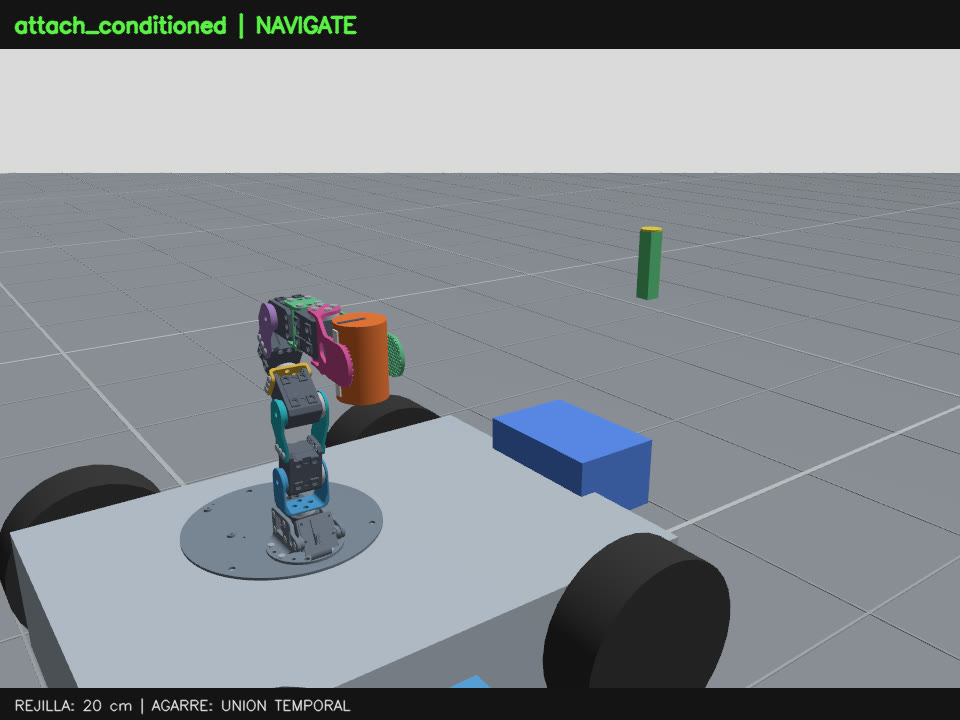

# Videos de cierre: brazo recogido y recorrido suave

Grabaciones reales de Gazebo, **60 fps CFR, H.264**, a **1× del tiempo simulado**.
La revisión recoge el brazo antes de conducir, redondea la esquina sin parada
intermedia y aumenta la velocidad de crucero de 0,06 a 0,10 m/s.
El brazo usa movimientos suaves de 2,2 s. La unión temporal conserva la
orientación relativa de la pieza hasta apoyarla y soltarla.

| Video | Duración | Resolución |
|---|---:|---:|
| [Ciclo completo, vista general](ciclo_completo_60fps.mp4) | 55.02 s | 1280×960 |
| [Ciclo completo, cámara a bordo](detalle_gripper_60fps.mp4) | 55.02 s | 960×720 |
| [Recogida y elevación](recogida_60fps.mp4) | 8.32 s | 960×720 |
| [Repliegue, curva continua y llegada](repliegue_y_traslado_60fps.mp4) | 25.97 s | 1280×960 |
| [Despliegue y depósito, vista general ampliada](deposito_60fps.mp4) | 11.25 s | 960×720 |

La cámara a bordo está elevada para incluir el brazo recogido. Al bajar la
pieza, parte inferior del pedestal queda fuera de esa vista; el clip de
depósito usa la vista general recortada a (x=480, y=120, ancho=440, alto=330)
y ampliada a 960×720 para mostrar el soporte completo. La vista general
del ciclo completo no tiene ese recorte.

## Verificación y límites

- Los cinco archivos pasaron ffprobe y decodificación completa sin errores.
- La corrida grabada pasó todos los criterios: ciclo 55,28 s, llegada de la
  base a 1,49 mm y depósito a 0,60 mm; una unión y una liberación.
- La variación medida pieza/gripper fue ≤0,690°, y el brazo permaneció
  en la postura de transporte con error articular máximo de 0,0039 rad.
- La vista general recibió 2167 imágenes y la cercana 2635, para 3301 frames
  CFR en cada ciclo. Si falta una imagen, se repite la anterior: no hay
  interpolación ni garantía de 60 imágenes nuevas por segundo.
- Las simulaciones tardan más en tiempo real que el video; no se aceleró el
  tiempo simulado para hacer parecer más veloz la maniobra.
- Se inspeccionaron fotogramas de agarre, repliegue, giro, llegada y liberación.
  La vista general y las mediciones confirman el depósito sobre el pedestal.

[Manifest y hashes](manifest.json) ·
[Resultados y pruebas](../../results/verified/mobile_smooth_20260909/README.md) ·
[Guía](../../docs/mobile_pick_and_place.md).

Los [videos anteriores](../pick_place_movil/README.md) se conservan como referencia.
