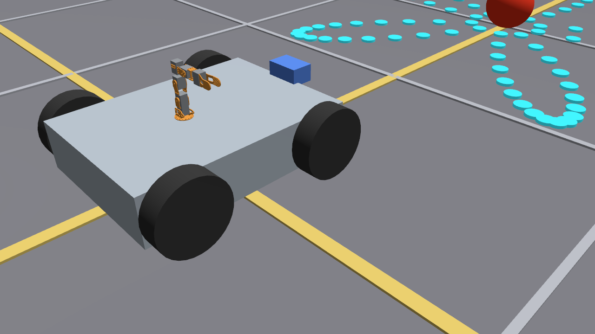
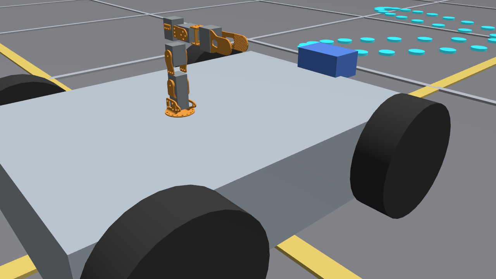
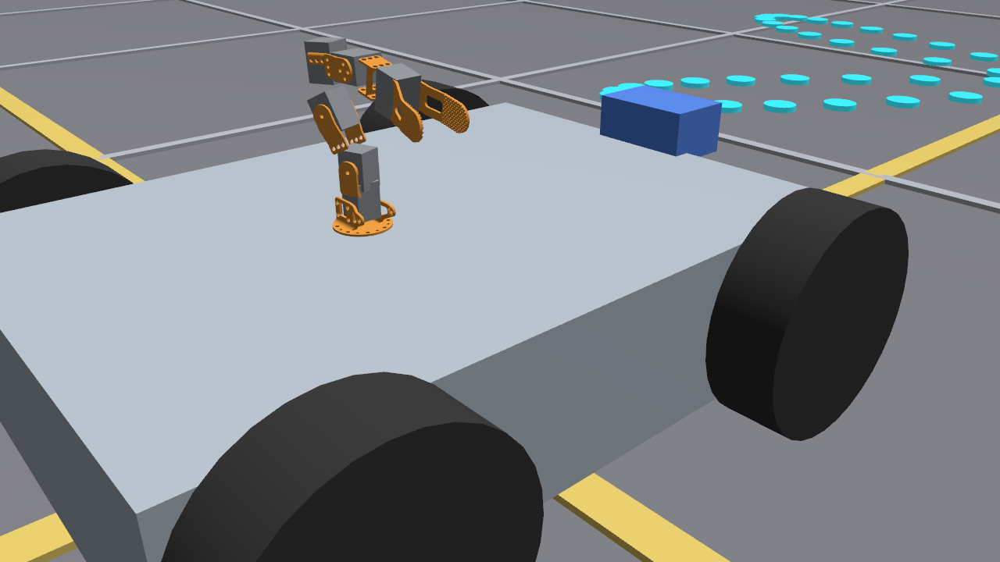
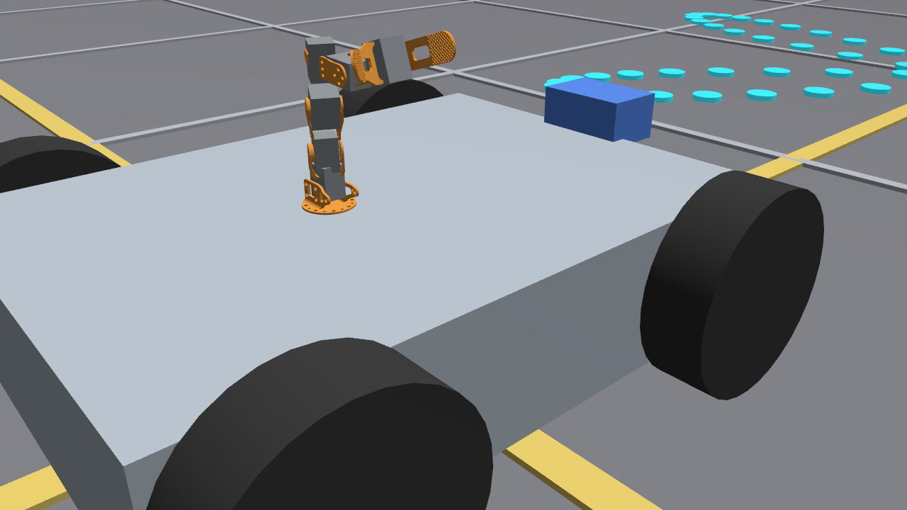
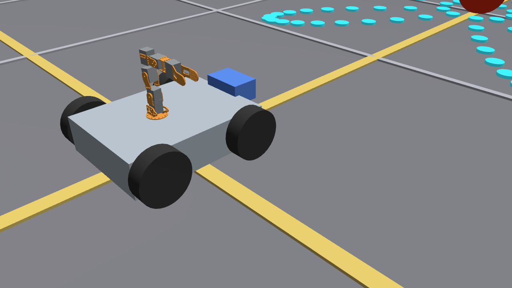
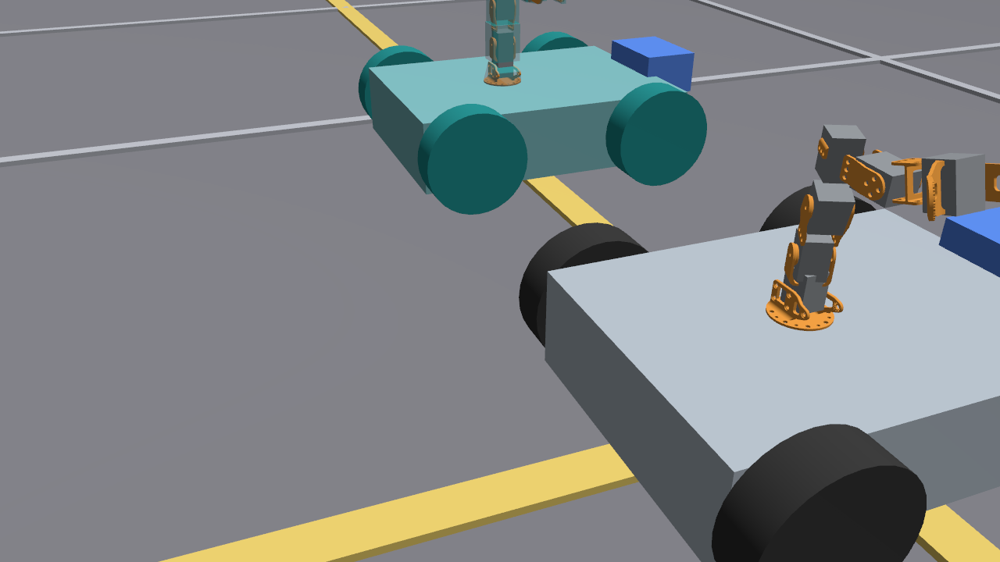
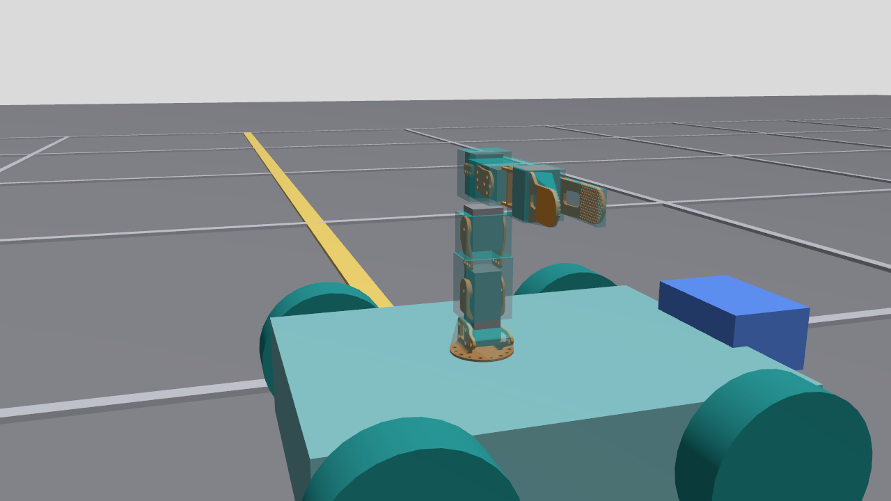
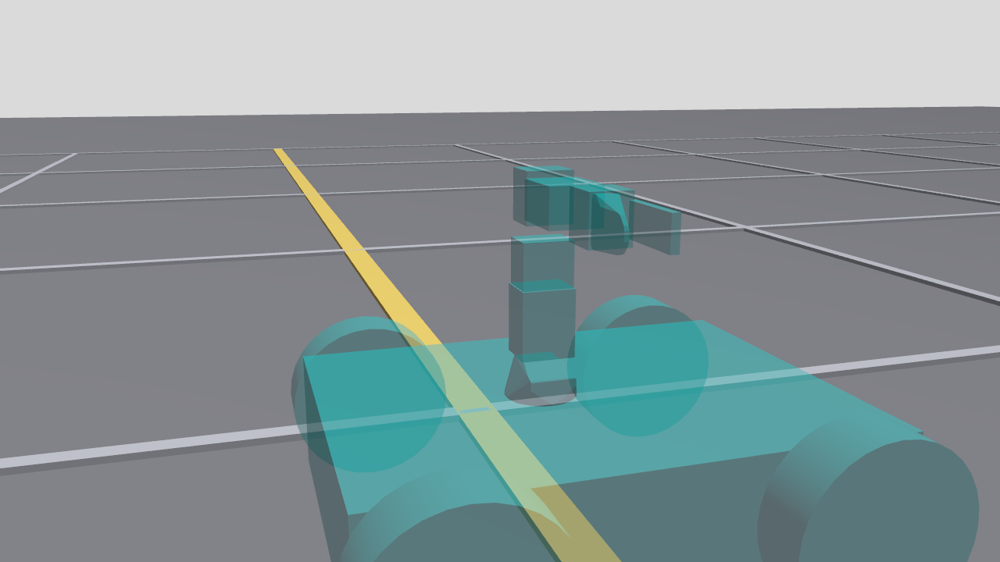

# Validación mecánica del Poppy Ergo Jr sobre base móvil

Este documento registra una corrección importante: un URDF sintácticamente válido, con controladores activos y joints que alcanzan sus consignas, todavía puede representar un robot físicamente mal ensamblado. El criterio final combina sintaxis, cinemática/control, geometría mecánica y física/simulación.

## Fallo original y por qué pasó inadvertido

La captura anterior conserva el caso pedagógico. El modelo anterior pasaba `check_urdf`, publicaba seis joints y alcanzaba dos poses, pero encadenaba casi todos los motores mediante desplazamientos sobre Z. Los validadores comprobaban existencia, escala, bounds, masa, inercia y seguimiento de consignas; no comprobaban que los ejes coincidieran con horns y brackets reales ni que la cadena tuviera la topología espacial del mecanismo.

Síntoma: brackets separados, piezas aparentemente flotantes y movimientos alrededor de pivotes no físicos. Causa raíz: frames y `origin` matemáticamente consistentes, pero incompatibles con el montaje CAD.

## Fuentes de autoridad

La auditoría cruzó tres fuentes independientes:

1. CAD oficial Poppy Ergo Jr versionado en `meshes/poppy_ergo_jr/source/`, commit de hardware `97ce599be8c717843c45ebf48341f2ebf8f250b3`.
2. [Guía oficial de construcción mecánica](https://docs.poppy-project.org/en/assembly-guides/ergo-jr/mechanical-construction), que fija orden de piezas, lado de los horns y orientación de las marcas de cero.
3. [URDF oficial Poppy Ergo Jr](https://github.com/poppy-project/poppy_ergo_jr_description), auditado en el commit `7eb32bd385afa11dea5e6a6b6a4a86a0243aaa2b`.

El URDF oficial se usó como referencia de transforms; no se copiaron sus meshes. Toda la geometría visual y collision continúa procediendo del pipeline CAD de este repositorio.

## Auditoría joint por joint

Los valores están expresados como `xyz [m] / rpy [rad] / axis`. “Anterior” corresponde al modelo que produjo la captura de fallo.

| Joint | Actual anterior | Oficial | Evidencia CAD/guía | Corrección final | Justificación |
|---|---|---|---|---|---|
| m1 | `0 0 .0328 / 0 0 0 / 0 0 1` | `0 0 .0327993 / 0 0 0 / 0 0 1` | eje vertical del primer horn sobre la base | oficial | ya era coherente; se conservó el eje y se usó la cota exacta |
| m2 | `0 0 .024 / 0 0 0 / 0 1 0` | `0 0 .0240007 / 0 -pi/2 0 / 0 0 -1` | `long_U` coloca el siguiente eje perpendicular a m1 | oficial | el cambio de frame de 90° convierte la cadena vertical en el pivote físico lateral |
| m3 | `0 0 .054 / 0 0 0 / 1 0 0` | `.054 0 0 / 0 0 0 / 0 0 -1` | laterales horn-to-horn unen ejes paralelos separados 54 mm | oficial | la distancia pertenece a X del frame hijo, no a Z global |
| m4 | `0 0 .045 / 0 0 0 / 0 1 0` | `.045 0 0 / 0 -pi/2 0 / 0 0 -1` | `short_U` introduce otro cambio perpendicular a 45 mm | oficial | alinea el servo dentro del bracket y su horn con el siguiente cuerpo rígido |
| m5 | `0 0 .048 / 0 0 0 / 1 0 0` | `0 -.048 0 / 0 -pi/2 0 / 0 0 1` | el par lateral desplaza el eje 48 mm sobre el lado del soporte | oficial | corrige tanto el eje como el lado físico del desplazamiento |
| m6 | `0 0 .058 / 0 0 0 / 0 1 0` | `0 -.058 0 / 0 -pi/2 0 / 0 0 -1` | fijación y pivote de la mordaza están separados 58 mm | oficial | coloca el pivote en el centro real de la pinza y conserva su sentido de cierre |

La coincidencia final con el URDF oficial no se aceptó de forma ciega: las distancias aparecen en centros de horns y caras de unión del CAD; la guía confirma qué bracket se monta después de cada motor y hacia qué lado mira.

## Links como cuerpos rígidos

La regla aplicada fue: cada link contiene todo lo que permanece rígidamente unido cuando gira su joint padre.

| Link | Cuerpo rígido |
|---|---|
| `poppy_mount_link` | base impresa y estator de m1 |
| `poppy_link_1` | `long_U` y cuerpo de m2 |
| `poppy_link_2` | laterales horn-to-horn/side-to-side y cuerpo de m3 |
| `poppy_link_3` | `short_U` y cuerpo de m4 |
| `poppy_link_4` | segundo par lateral y cuerpo de m5 |
| `poppy_link_5` | fijación de gripper, cuerpo de m6 y mordaza fija |
| `poppy_link_6` | mordaza rotativa, único elemento que gira con m6 |

Para expresar el CAD en estos frames se hornearon transformaciones reproducibles en `prepare_poppy_assets.py`: links 2 y 3 usan `Ry(+90°)`, link 4 usa `Rx(+90°)`, la fijación y mordaza fija de link 5 usan `Ry(-90°) @ Rz(180°)` con traslación al pivote de m6, y la mordaza móvil usa `Rz(180°)`. Los `origin` visuales quedan en cero y las matrices se registran en `asset_manifest.json`.

## Comparación referencia vs. modelo corregido

La referencia oficial y nuestro modelo coinciden razonablemente en topología: base, `long_U`, dos secciones laterales, `short_U`, segunda sección lateral, fijación y pinza. Los ejes alternan orientación como exige el montaje, los servos quedan dentro de los soportes y la mordaza fija permanece con link 5 mientras la móvil gira con m6. Las diferencias deliberadas son materiales/colores, cajas aproximadas para los XL-320 y la ausencia de cableado y tornillería.

## Evidencia visual 1:1 y poses

Poppy permanece a escala métrica 1:1; el Xacro no aplica `scale` a sus meshes.

Las imágenes se obtuvieron de una cámara Gazebo durante simulaciones reales. En home y ambas poses se observa continuidad entre brackets, servos contenidos en los soportes, ejes sobre pivotes plausibles y ausencia de gaps o interpenetraciones groseras. Las dos posiciones de m6 incluidas en home/poses verifican la mordaza abierta y en otra posición.

## Plataforma compacta

Poppy se corrigió primero a 1:1. Después se evaluaron tres bases, sin escalar el brazo:

| Candidato | Base L x W (m) | Rueda (m) | Evaluación |
|---|---:|---:|---|
| compacto mínimo | .36 x .28 | .065 | huella y cámara demasiado ajustadas |
| compacto equilibrado | .40 x .30 | .070 | proporción, estabilidad y espacio de montaje equilibrados; elegido |
| compacto estable | .44 x .32 | .075 | más estable, pero vuelve a dominar visualmente al Ergo Jr |

| Parámetro | Anterior | Final |
|---|---:|---:|
| base L x W x H | .72 x .52 x .16 m | .40 x .30 x .10 m |
| masa de base | 18.0 kg | 6.0 kg |
| rueda radio x ancho | .115 x .070 m | .070 x .045 m |
| separación de ruedas | .600 m | .345 m |
| posición longitudinal rueda | .270 m | .140 m |
| cámara `x,z` sobre base | `.38,.10` m | `.225,.050` m |
| mount Poppy `x,z` | `-.05,.08` m | `-.030,.050` m |

Las dimensiones son propiedades Xacro (`base_length`, `base_width`, `base_height`, `wheel_radius`, `wheel_width`, `wheel_x`, `wheel_y`, `camera_x`, `camera_z`, `arm_mount_x`, `arm_mount_z`). Para una caja homogénea de 6 kg se recalcularon `Ixx=0.050`, `Iyy=0.085` e `Izz=0.125 kg·m²`. Cada rueda de .45 kg usa `Iaxial=0.000627` e `Iradial=0.001103 kg·m²`. `controllers.yaml` usa exactamente radio `.070` y separación `.345`.

## Collision geometry

No se sustituyeron collisions por visuales. Los links intermedios usan primitivas `box`; mount y link 6 usan convex hull; los visuales conservan mesh detallado. La mordaza sigue comparando 32 168 triángulos visuales con 92 de collision.

`generate_collision_preview.py` genera un URDF estático reproducible que duplica cada collision como visual cian translúcido o muestra solo collisions. Las imágenes verifican alineación y ausencia de colliders flotantes. No equivalen al overlay nativo de la GUI: Gazebo GUI sí pudo lanzarse bajo WSLg, pero la automatización/captura de la ventana falló por `windows sandbox failed: helper_unknown_error: setup refresh had errors`; una captura X11 resultó negra. Esta limitación se declara, no se presenta como inspección GUI directa.

La autocolisión permanece deshabilitada. Solapes modestos entre colliders de links vecinos se aceptan para representar uniones físicas; no se separaron piezas artificialmente para evitarlos.

## Validación transform/FK independiente

`validate_mechanical_assembly.py` comprueba transforms exactos, ejes, masas, inercias, URI, escala 1:1 y collisions simplificadas, y calcula FK sin usar TF de ROS. `run_diagnostic.sh` captura a su vez `base_footprint -> poppy_moving_tip`; `validate_diagnostic.py` compara ambos cálculos.

| Pose | q m1..m6 (rad) | Punta esperada desde mount XYZ (m) | Error FK vs TF posición | Error cuaternión |
|---|---|---|---:|---:|
| home | `0,0,0,0,0,0` | `0,-.158,.1558` | validación estática | — |
| pose 1 | `.35,-.45,.40,-.35,.25,.15` | `-.016193,-.130942,.130429` | .000474 m | .000781 |
| pose 2 | `-.45,.35,-.30,.45,-.35,.75` | `-.045117,-.158248,.178372` | .000462 m | .000562 |

Los errores incluyen el redondeo a tres decimales de `tf2_echo` y quedan bajo gates de 2 mm y 0.003 en cuaternión. El alcance home desde mount es .221896 m. Esta prueba detecta cambios de frame que `/joint_states` por sí solo no revela.

## Regresión final

- pipeline CAD y conversión STEP: PASS;
- validador mecánico: 6 joints, 3 poses FK, 0 fallos;
- build y tests: 7 tests, 0 errores, fallos ni skips;
- diagnóstico: PASS; base .244 m con odom y TF coherentes, cámara 640x480/fx 554.383 y detector activo;
- experimento A: detección 100 %, MAE objetivo .528910 m, desplazamiento ~0;
- experimento B: detección 100 %, MAE objetivo .149327 m, RMS horizontal .024978, desplazamiento .745751 m, comandos activos 99.14 %;
- mejora A→B: 71.77 %, comparador PASS.

La cámara conserva resolución, FOV y `CameraInfo`; su mount cambió para la base compacta. La esfera conserva centro a .12 m de altura, coherente con su radio y el nuevo plano de rodadura.

## Lección generalizable

La validación de un robot importado debe ocurrir en cuatro niveles:

1. sintaxis: Xacro/URDF y URI válidas;
2. cinemática/control: cadena, joints, comandos y estados;
3. geometría mecánica: cuerpos rígidos, pivotes, frames, orientación y ensamblaje visual;
4. física/simulación: masa, inercia, collision, odometría, sensores y comportamiento integrado.

Solo el acuerdo de los cuatro niveles permite declarar el modelo válido.
