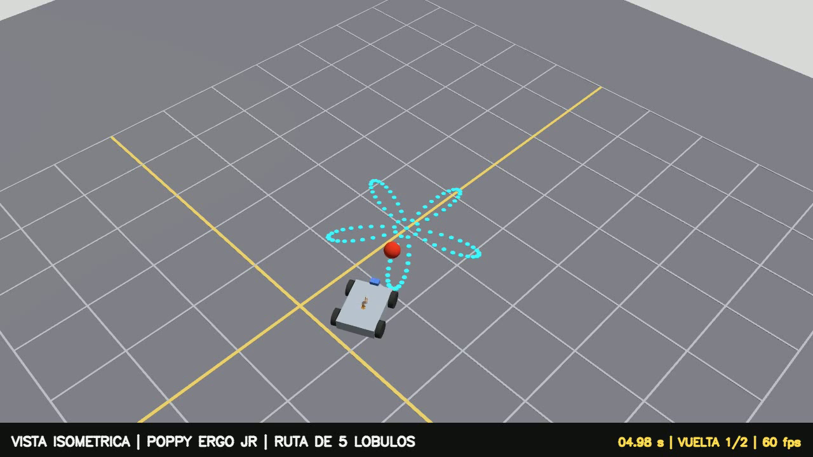
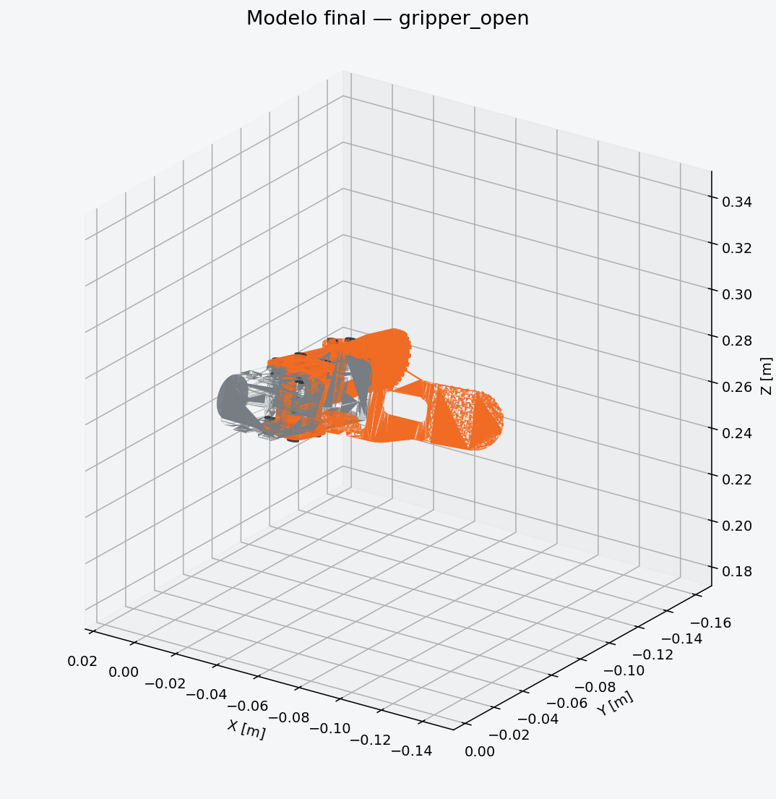
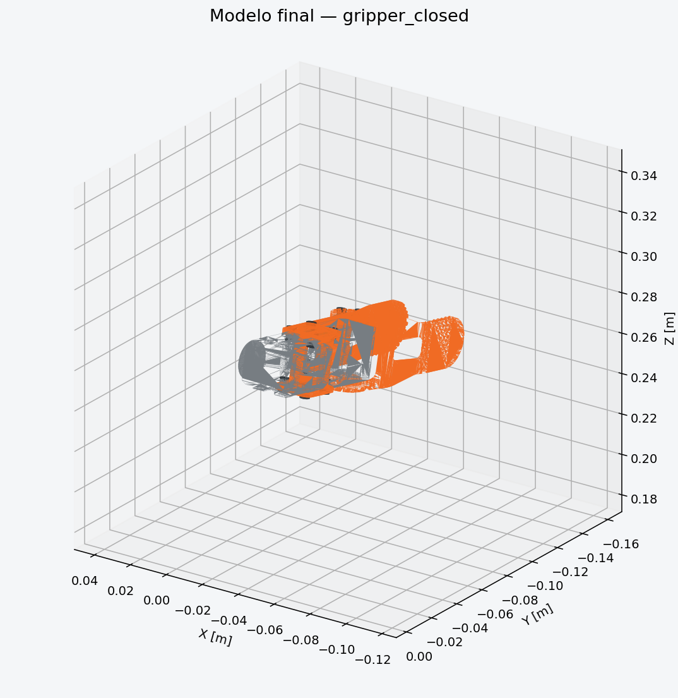
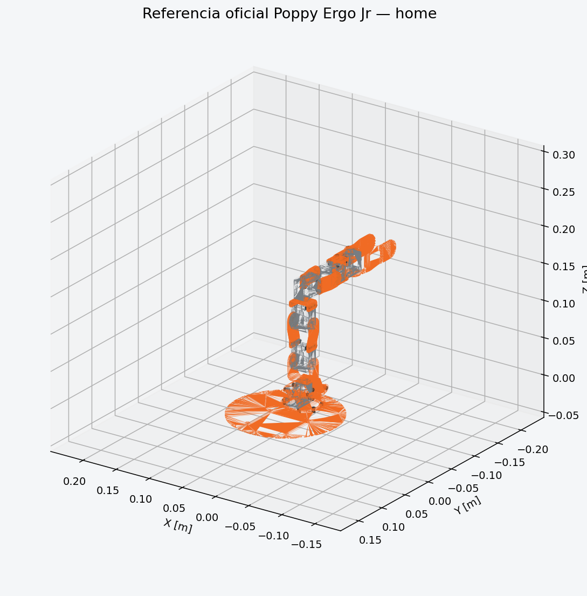
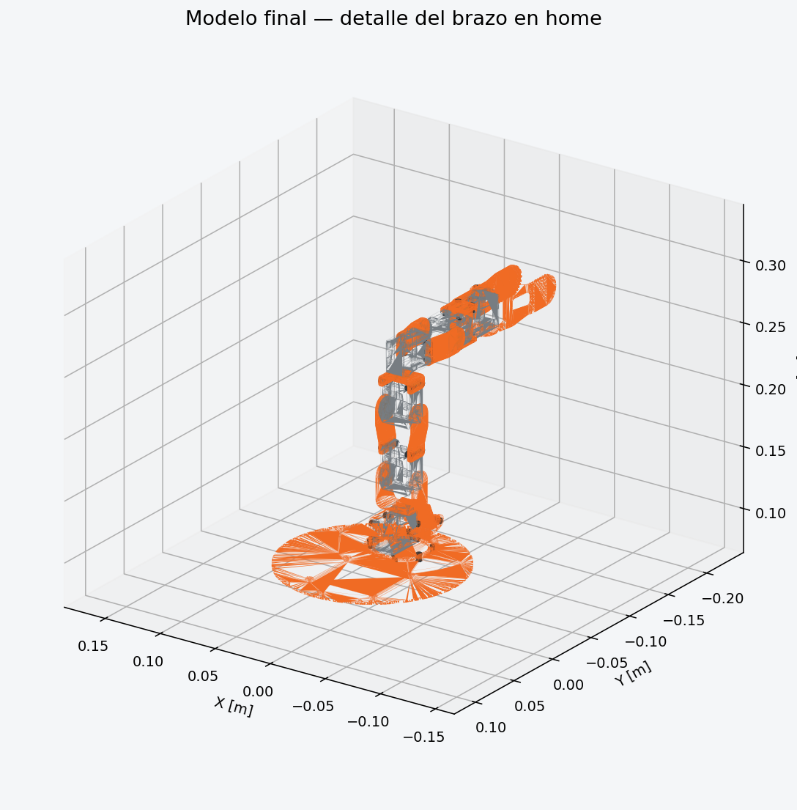
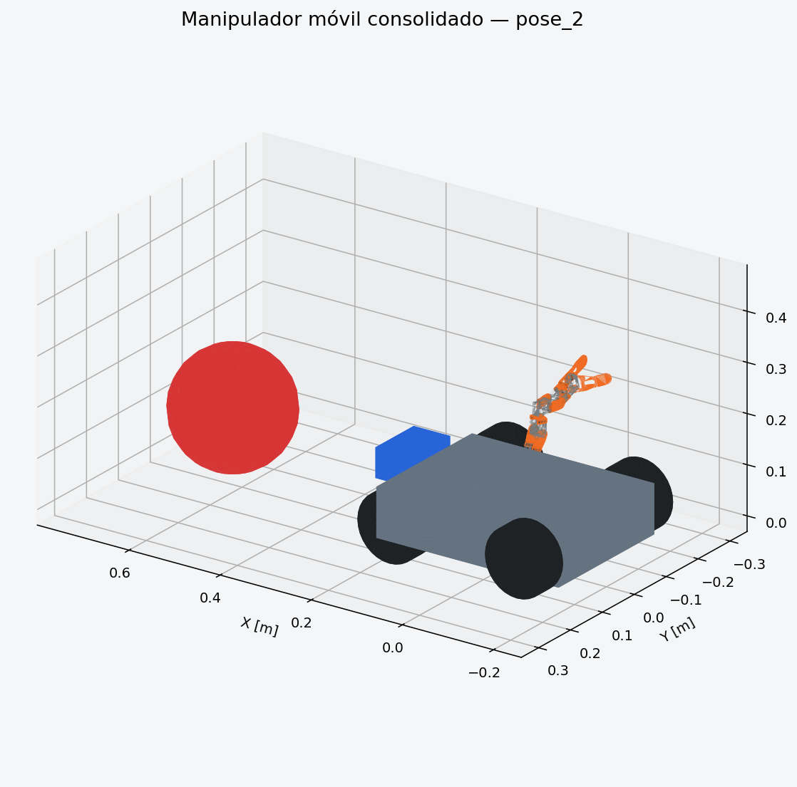
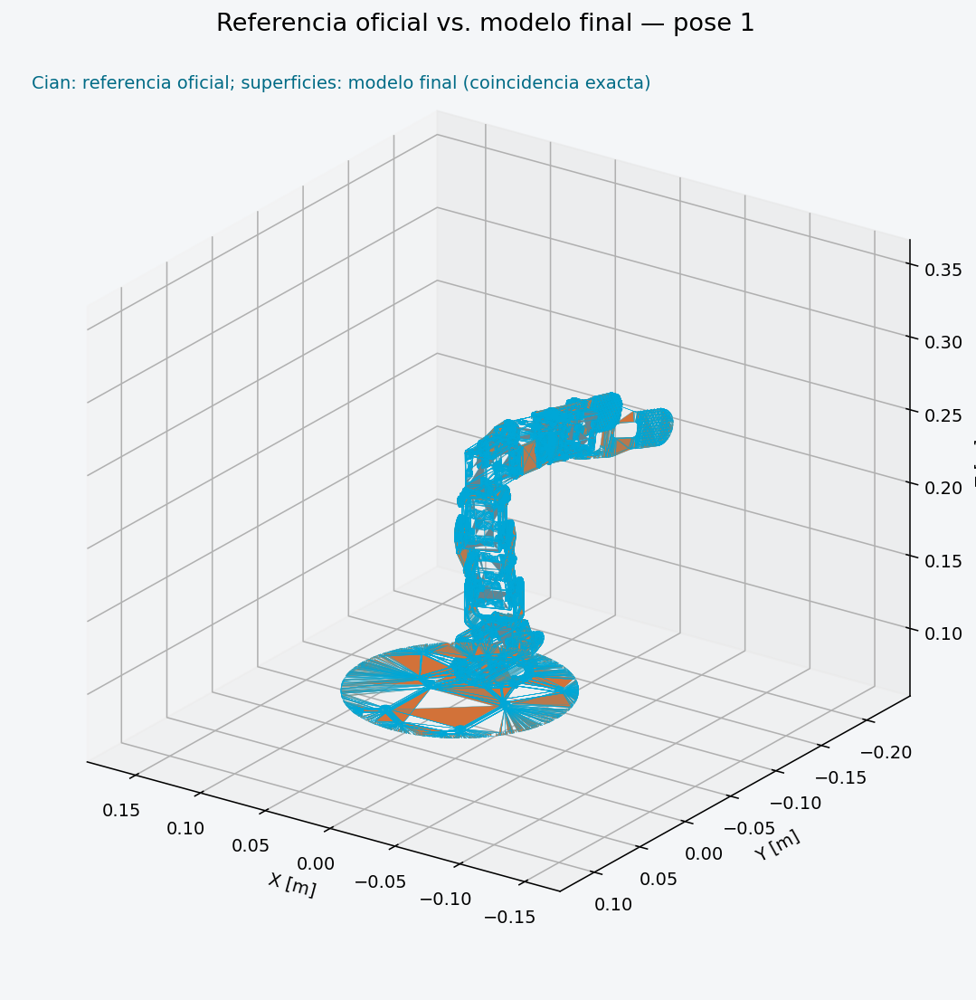
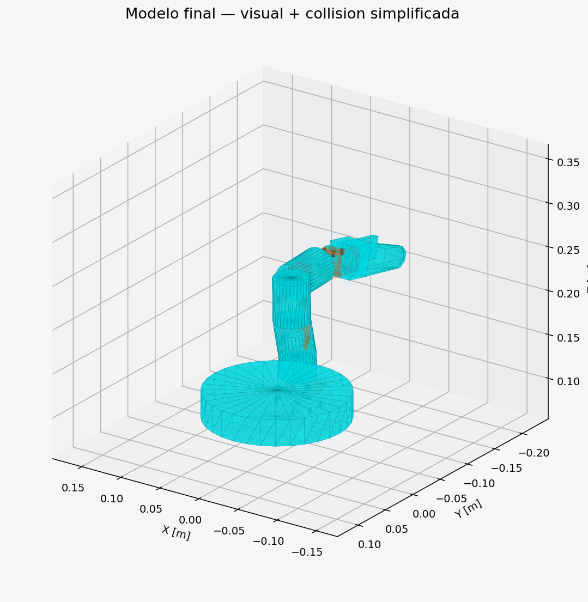

# Validación mecánica final del Poppy Ergo Jr sobre base móvil

## Estado

Este documento reemplaza las conclusiones de la primera corrección parcial. El
baseline de este último hito fue
`d5c18317df4e86b80c4dd9a8478b531cc8e82059`.

Resultado final:

- intento autónomo: **FAIL** por geometría autoritativa incompleta;
- método final: **official_reference_consolidation**, fallback **B3**;
- escala Poppy: 1:1;
- referencia oficial/final: PASS;
- Gazebo/TF/control/cámara/tracking: PASS.

## Failure case preservado

La cadena anterior pasaba `check_urdf`, ros2_control, `joint_states` y una FK
interna. Aun así, brackets, cuerpos de motor, horns y caras de montaje no
coincidían. El falso positivo ocurrió porque se medían bounds, existencia de
meshes y seguimiento de consignas, pero no superficies de unión.

Historia conservada:

1. primer modelo geométricamente incorrecto;
2. primera corrección de joints/base, aún con meshes reexpresados heurísticamente;
3. último registro automático de cada componente impreso;
4. consolidación B3 con el gold standard oficial.

## Fuentes de autoridad

1. CAD STEP/STL Poppy en `source/hardware/`,
   `poppy-project/poppy-ergo-jr@97ce599be8c717843c45ebf48341f2ebf8f250b3`;
2. guía oficial de construcción mecánica;
3. URDF/Xacro y DAE de
   `poppy-project/poppy_ergo_jr_description@7eb32bd385afa11dea5e6a6b6a4a86a0243aaa2b`.

El intento autónomo usó la fuente 3 como objetivo de evaluación. Tras el FAIL,
B3 la usó como hoja de respuestas. Esta transición está explícita en
`results/verified/mechanical_alignment/decision.json`.

## Auditoría joint por joint

| Joint | Transform previo defectuoso | Oficial/final xyz; rpy; axis | Evidencia/decisión |
|---|---|---|---|
| m1 | casi correcto | `0 0 .0327993; 0 0 0; 0 0 1` | eje vertical de base; oficial |
| m2 | Z sin cambio de frame | `0 0 .0240007; 0 -pi/2 0; 0 0 -1` | long U cambia 90°; oficial |
| m3 | `0 0 .054` | `.054 0 0; 0 0 0; 0 0 -1` | laterales separan ejes 54 mm en X |
| m4 | `0 0 .045` | `.045 0 0; 0 -pi/2 0; 0 0 -1` | short U y pivote perpendicular |
| m5 | `0 0 .048` | `0 -.048 0; 0 -pi/2 0; 0 0 1` | segundo lateral desplaza en Y |
| m6 | `0 0 .058` | `0 -.058 0; 0 -pi/2 0; 0 0 -1` | centro físico de mordaza rotativa |

El comparador final exige parent/child, traslación, orientación y eje exactos.
No deduce corrección mecánica de que el joint responda.

## Cuerpos rígidos

| Link | Elementos que permanecen unidos |
|---|---|
| mount | base impresa y motor m1 |
| link 1 | long U y motor m2 |
| link 2 | laterales y motor m3 |
| link 3 | short U y motor m4 |
| link 4 | segundo par lateral y motor m5 |
| link 5 | fijación, motor m6 y mordaza fija |
| link 6 | mordaza móvil |

En el visual B3 esta composición viene ya consolidada en los siete DAE
oficiales. El Xacro no añade cajas de servo duplicadas. La mordaza fija sigue
link 5; la móvil gira con m6.

## Último intento autónomo

`scripts/cad/align_poppy_to_official.py` evaluó 24 rotaciones propias, centros
AABB, ICP recortado y Chamfer/landmarks. Usó una sola iteración global de las dos
permitidas.

Los diez componentes impresos pasaron; RMS entre 0,086 y 0,505 mm y máximo
residual de landmarks 0,067 mm. El conjunto completo falló porque el CAD propio
no incluye sólidos completos de motores, horns y fasteners. Sin ellos no puede
verificarse contacto mecánico aunque un bracket registre muy bien.

Por tanto, el gate global es honestamente FAIL. Detalles y matrices 4x4:
[mechanical_alignment_method.md](mechanical_alignment_method.md).

## Consolidación oficial B3

Los visuales finales son copias geométricamente inalteradas de:

`base.dae`, `long_U.dae`, `section_1.dae`, `section_2.dae`,
`section_3.dae`, `section_4.dae` y `gripper.dae`.

Se conservaron hashes, upstream `package.xml` y GPL-3.0-only. Las mallas
CAD-derived propias siguen en Git y se instalan como material docente, pero no
son el visual runtime referenciado por el Xacro.

`validate_official_consolidation.py` compara:

| Elemento | Filas | Error posición máx. | Error orientación máx. | Estado |
|---|---:|---:|---:|---|
| joints | 6 | 0 m | 0 rad | PASS |
| visual origins/assets | 7 | 0 m | 0 rad | PASS |
| FK links/tool, 5 poses | 35 | 0 m | 2,98e-8 rad | PASS |

El residual angular no nulo es redondeo de `acos`, no una diferencia de frame.

## Tool frame y gripper

`poppy_tool_frame` está fijo a `poppy_fixed_tip` en link 5. No gira con m6 y
coincide con `fixed_tip` oficial en home, pose 1, pose 2, abierto y cerrado.

Convención medida:

- cerrado: m6 = 0 rad, gap aproximado entre caras internas 2,1 mm;
- abierto: m6 = 1,20 rad;
- la mordaza es rotativa, no paralela.

## Evidencia visual

El manifest de 17 capturas registra renderer, pose, bounds y flags. Son renders
técnicos offscreen de los triángulos DAE y transforms exactos, no screenshots
de GUI.

Los close-ups `close_m1_m2.png` … `close_m5_m6.png` y
`close_gripper.png` permiten inspeccionar seis uniones consecutivas.

## Collision geometry

Las collisions se realinearon sin sustituirlas por visuales:

- cilindros para mount y links 1–4;
- dos boxes para motor/fijación y dedo fijo de link 5;
- hull convexo propio de 92 triángulos para link 6.

El overlay es offscreen y reproducible. La inspección GUI directa no pudo
automatizarse por `helper_unknown_error` en WSL; no se inventó evidencia. Gazebo
real cargó todos los meshes sin `[Err]`. La autocolisión permanece deshabilitada
y no se alejaron piezas para evitar solapes de uniones vecinas.

## Plataforma compacta

Poppy permanece 1:1. De tres candidatos se conserva el equilibrado:

| Parámetro | Final |
|---|---:|
| base | 0,40 × 0,30 × 0,10 m |
| masa base | 6,0 kg |
| inercia | 0,050 / 0,085 / 0,125 kg·m² |
| ruedas | radio 0,070; ancho 0,045 m |
| wheel separation | 0,345 m |
| posición ruedas | X ±0,140; Y ±0,1725 m |
| mount brazo | X −0,030; Z 0,050 m sobre base |
| cámara | X 0,225; Z 0,050 m sobre base |

`controllers.yaml` usa el mismo radio/separación. No existen variantes
ambiguas en el launch por defecto.

## FK/TF y regresión Gazebo

Diagnóstico final:

| Verificación | Resultado |
|---|---|
| seis joints, dos poses | PASS; error máx. 2,04e-10 rad |
| tip FK/TF | error posición máx. 0,474 mm |
| tool FK/TF | error posición máx. 0,784 mm |
| orientación tip/tool | distancia cuaternión máx. 0,000781 |
| base | desplazamiento 0,680 m |
| odom vs TF | coherente |
| cámara | fx 554,383 px; imagen/CameraInfo activos |
| esfera | distancia inicial estimada 1,7919 m |
| carga Gazebo | sin errores de mesh |
| procesos residuales | ninguno |

Build: 1 paquete. Tests: 7/7 PASS.

Experimento final:

| Métrica | A sin tracking | B con tracking |
|---|---:|---:|
| detección | 100 % | 100 % |
| MAE distancia objetivo | 0,526848 m | 0,119951 m |
| RMS horizontal | 0,474685 | 0,025141 |
| desplazamiento robot | ≈0 m | 0,405552 m |
| comandos activos | 0 % | 99,0 % |

Mejora A→B: 77,2323 %, comparador PASS.

## Lección generalizable

La aceptación requiere cuatro niveles simultáneos:

1. sintaxis/URI;
2. cinemática y control;
3. geometría mecánica, superficies y cuerpos rígidos;
4. física/simulación e integración.

Un PASS de los dos primeros no compensa un FAIL del tercero.
