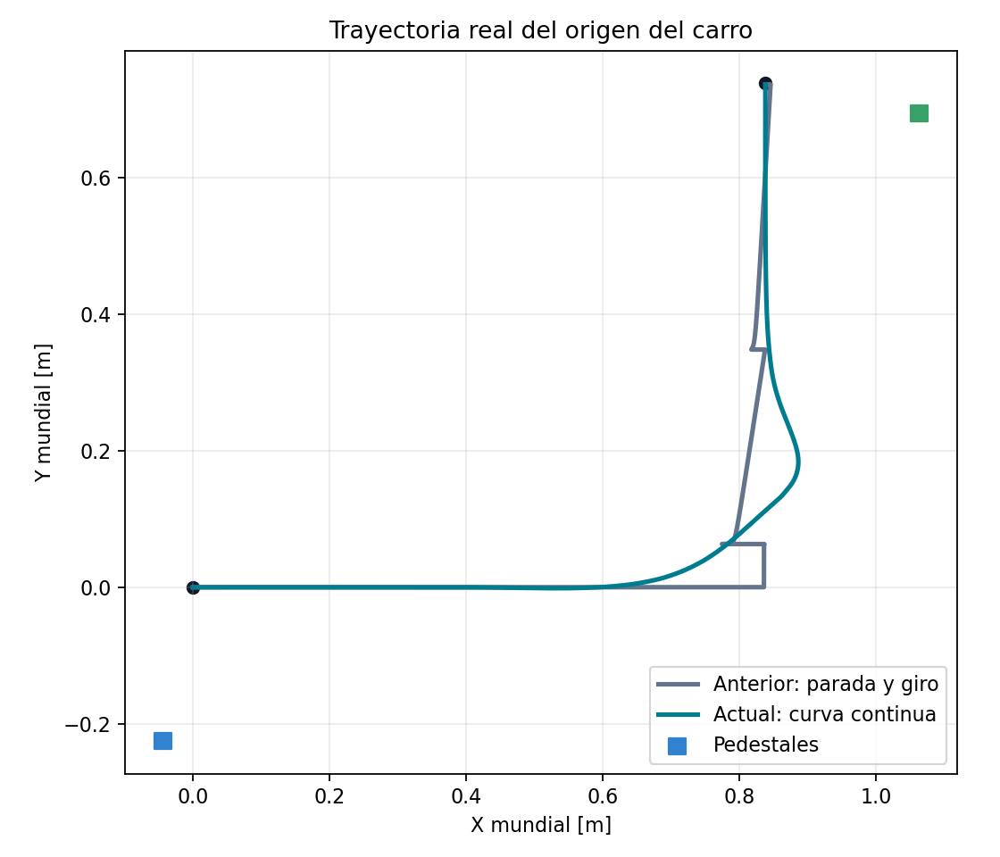

# Cierre: brazo recogido y traslado suave — 2026-09-09

Estado: **PASS**. Dos ciclos nominales con las mismas fuentes runtime, una
cancelación con carga y la regresión estacionaria de contacto físico sin attach.
Las 89 pruebas automatizadas, el lint de siete archivos y la auditoría mecánica
de seis articulaciones también pasan.

| Métrica | Sin grabación (604) | Con grabación (603) |
|---|---:|---:|
| Ciclo simulado | 56.68 s | 55.28 s |
| Transporte NAVIGATE | 21.80 s | 21.66 s |
| Recorrido real | 1.5199 m | 1.5198 m |
| Error de llegada de la base | 1.54 mm | 1.49 mm |
| Error de depósito | 0.36 mm | 0.59 mm |
| Variación pieza/gripper | 0.700° | 0.690° |
| Error articular máximo en transporte | 0.0018 rad | 0.0039 rad |
| Attach / detach | 1 / 1 | 1 / 1 |

El ciclo anterior grabado duraba unos 90 s. La mejora procede de la ruta continua
y de los tiempos del brazo; los videos nuevos siguen a 1× del tiempo simulado.
No se han acelerado los videos para aparentar una mejora.

## Trazabilidad

- run_nominal/: seed 604, sin cámaras; run.json, CSV y auditoría independiente.
- run_recorded/: seed 603, dos cámaras; run.json, CSV, auditoría y medios originales.
- negative_cancel/: CANCELLED esperado; safety_assertions.json PASS.
  Desplazamiento tras cancelar: 0,485 mm; sin detach ni apertura, pieza elevada.
- stationary_physical_regression/: PASS, sin unión temporal.
- source_fingerprints.json: SHA-256 de 28 fuentes runtime, sin cambios
  durante las dos corridas finales. Worktree todavía sin commit.
- validation.json, pytest.log, lint.log, mechanical_assembly.json:
  comprobaciones automatizadas.
- summary.json: métricas y criterios de todas las corridas nominales.
- development/first_control_check: comprobación inicial PASS, anterior a la
  instrumentación completa de postura.
- development/camera_framing_cancel: captura interrumpida voluntariamente
  por recorte visual del gripper. Se reencuadró la cámara y se repitió;
  no se presenta la captura cancelada como éxito.

Las muestras de la corrida grabada se toman con un temporizador de pared;
pueden repetir observaciones de un mismo instante simulado. No equivalen a
muestras físicas independientes. El criterio de postura exige feedback fresco
en tiempo simulado y error ≤0,035 rad durante NAVIGATE y DOCK_BASE.

La unión temporal conserva orientación **relativa al gripper**, no orientación
mundial constante mientras el carro gira. Sigue condicionada al contacto bilateral.

[Videos entregables](../../../captures/pick_place_movil_suave/README.md) ·
[Guía](../../../docs/mobile_pick_and_place.md).

## Comparación geométrica

Reproducción del gráfico, desde la raíz del repositorio:

~~~bash
python3 tools/plot_mobile_route_comparison.py --baseline results/verified/mobile_pick_place_20260909/run_01/samples.csv --current results/verified/mobile_smooth_20260909/run_nominal/samples.csv --output results/manual/route_comparison.png
~~~
